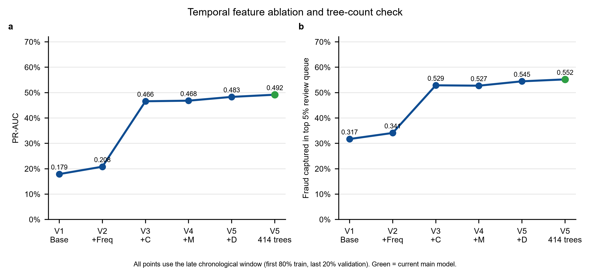

# IEEE-CIS 欺诈检测：时间验证与可解释特征工程

基于 IEEE-CIS Fraud Detection 公开竞赛数据的表格二分类项目。目标是完整学习金融风控建模流程，而不是追逐 Kaggle 排名：数据审计、时间验证、类别不平衡评价、特征消融、误差分析、数据泄漏审计和可复现训练。

## 当前主模型

主模型为 V5：交易基础字段、训练期频率编码、匿名 C1-C14、匿名 D1-D15 及 D 字段缺失指示器，通过 XGBoost 训练。按 `TransactionDT` 前 80% 训练、后 20% 验证，固定 414 棵树。

| 指标 | 后期时间验证结果 |
|---|---:|
| ROC-AUC | 0.907598 |
| PR-AUC | 0.491739 |
| Top 1% 欺诈捕获率 | 24.78% |
| Top 5% 欺诈捕获率 | 55.22% |
| Top 10% 欺诈捕获率 | 69.12% |

随机切分的 PR-AUC 为 0.618253，显著更高，但只作为乐观参考，不用于模型选择。

## 关键实验结果

所有主线图表均来自 `results/metrics.csv` 的实际运行结果。除特别注明的随机切分参考外，均采用后期时间验证窗口（前 80% 时间训练、后 20% 时间验证）。

**1. 公平基线比较。** 在相同 V1 特征和时间切分下，XGBoost 的 PR-AUC 与 Top-5% 审核捕获率均高于逻辑回归、决策树和随机森林，因而进入后续特征工程主线。


**2. 特征消融。** C 组匿名字段是最大的性能增量；M 组增益很小，D 组与其缺失指示器带来后续改进。最终以 414 棵树的 V5 作为主模型。



**3. 为什么坚持时间验证。** 同一 V5 在随机切分下的 PR-AUC 看似更高，但这种切分会让未来模式进入训练集，因此不能用于模型选择。


**4. 审核预算下的业务价值。** 若只能人工审核评分最高的 5% 交易，V5 能捕获约 55.22% 的验证期欺诈，显著高于所有基线。


**5. 特征依赖与限制。** 匿名 C/D 字段及缺失模式贡献很大；这只是模型分裂增益关联，不能解释为因果，也不等于已确认可在线上获得。


## 复现

1. 从 Kaggle 获取 IEEE-CIS 的五个 CSV，放入 `data/raw/`。数据文件不提交到 GitHub。
2. 创建虚拟环境并安装依赖：`pip install -r requirements.txt`。
3. 在仓库根目录运行：

```powershell
python -m src.train
```

输出将写入 `results/v5_engineered_metrics.json`、`results/v5_engineered_thresholds.csv` 与 `results/v5_engineered_review_capacity.csv`。

## 仓库结构

```text
src/                         # 可复现的 V5 主模型流程
  data_loader.py             # 读取与时间切分
  features.py                # 特征构造和训练期频率编码
  preprocessing.py           # 预处理和 XGBoost 管道
  evaluate.py                # 指标、阈值和 Top-K 审核评价
  train.py                   # 训练入口
01_data_audit.py ... 27_*    # 保留的学习脚本与逐步实验记录
results/                     # 实际运行指标、图表和审计表
PROJECT_PLAN.md              # 项目路线与当前状态
```

编号脚本不是废弃文件：它们保留了从数据审计、逻辑回归、树模型、XGBoost、特征消融、时间验证到泄漏审计的学习过程。主模型仅由 `src/` 维护，避免后续修改破坏实验历史。

## 重要限制

- 公开数据集中的 C/D 等字段是匿名字段，业务含义和线上可得性未验证；
- 身份表候选字段在本时间消融中未带来增益，未进入主模型；
- 频率编码在本项目中仅由训练期拟合。生产部署必须只使用交易发生前的历史窗口；
- 官方测试集没有标签，不能作为离线模型选择或泛化指标依据。
