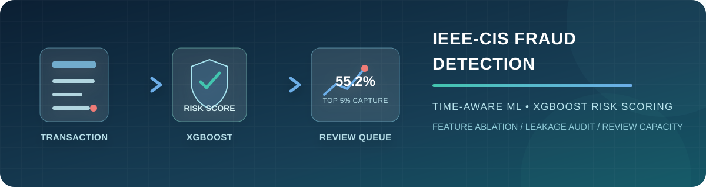
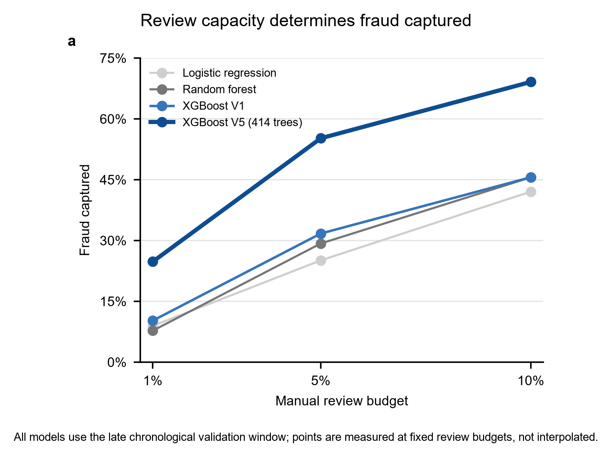
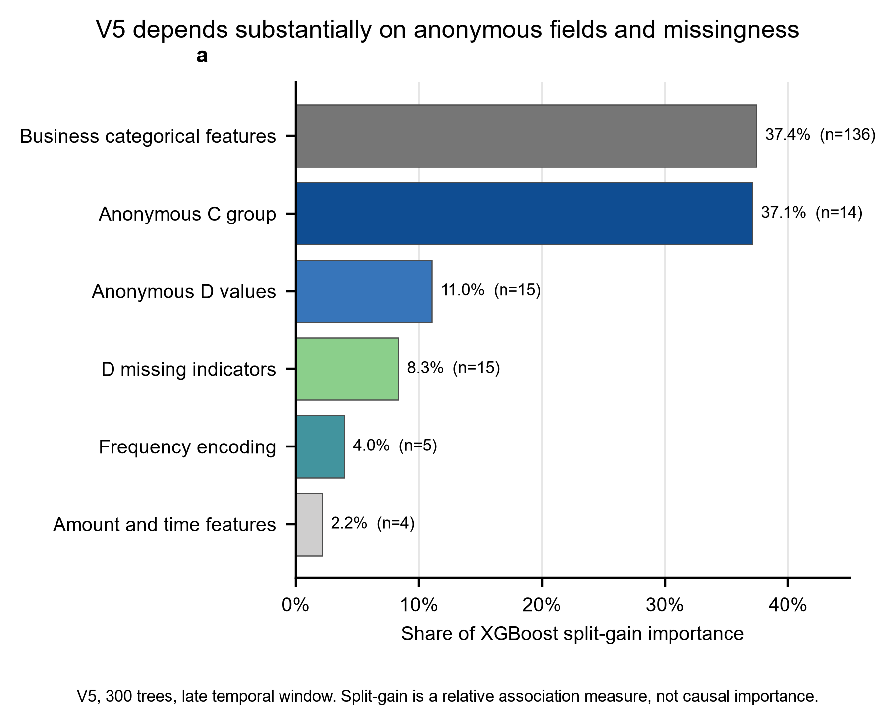
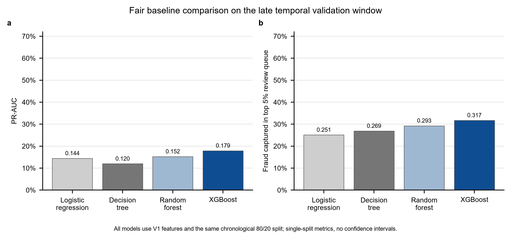
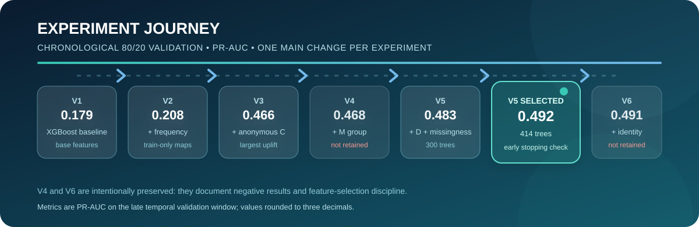
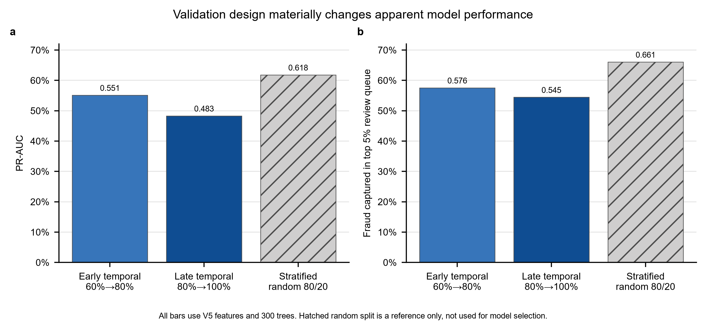

<div align="center">



# IEEE-CIS 欺诈检测：时间验证与可解释特征工程

**从数据审计、特征消融与时间验证，到人工审核容量评估的可复现风控机器学习项目**

[](https://www.python.org/)
[](https://pandas.pydata.org/)
[](https://scikit-learn.org/)
[](https://xgboost.readthedocs.io/)


[项目主体](#项目主体) · [实验过程](#实验过程) · [复现](#复现) · [项目限制](#项目限制)

</div>

## 项目主体

基于 [IEEE-CIS Fraud Detection](https://www.kaggle.com/c/ieee-fraud-detection) 公开竞赛数据，使用交易发生时的交易信息预测一笔交易是否可能为欺诈。项目重点不是追逐 Kaggle 排名，而是完成一条可解释、可复现、具有风控约束意识的表格机器学习流程：

```text
数据审计 → 时间验证 → 基线模型 → 特征消融 → 泄漏审计 → 人工审核容量评价
```

训练集有 **590,540** 笔交易，欺诈率为 **3.50%**。主评价采用 `TransactionDT` 前 80% 训练、后 20% 验证，模拟“用历史预测未来”；官方 test 没有标签，因此不参与模型选择、调参或阈值选择。

### 最终选择：V5 XGBoost

主模型 V5 使用交易基础特征、训练期频率编码、匿名 `C1`–`C14`、匿名 `D1`–`D15` 与 D 组缺失指示器。树数 414 由更早的前向时间窗口 early stopping 选出，再在后期时间窗口独立检查。

| 后期时间验证指标 | 结果 |
|---|---:|
| ROC-AUC | **0.907598** |
| PR-AUC | **0.491739** |
| Precision（阈值 0.5） | 23.11% |
| Recall（阈值 0.5） | 70.30% |
| Top 1% 欺诈捕获率 | 24.78% |
| Top 5% 欺诈捕获率 | **55.22%** |
| Top 10% 欺诈捕获率 | 69.12% |

### 人工审核场景

模型输出的是欺诈概率排序，而不是自动拒绝规则。若风控团队只能审核风险最高的 5% 交易，V5 在后期验证窗口中捕获了 **55.22%** 的欺诈；因此项目同时报告 Top-K 捕获率，而非只报告 AUC。



### 可解释性与风险边界

按 XGBoost split gain 汇总，业务类别特征占 37.42%，匿名 C 组占 37.08%，D 原值与 D 缺失指示器合计约占 19.39%。这说明匿名字段和“是否缺失”具有很强的关联信号；但它们的业务语义、生成时点与线上稳定性并未被公开数据集证明。



## 实验过程

编号脚本 `01_` 至 `27_` 是刻意保留的学习与试错记录，而非废弃代码。最终 `src/` 只维护已选定的 V5 流程；编号脚本保留“为何采用或放弃某个选择”的证据。

### 1. 数据审计与 identity 表

- 审计了训练/测试时间范围、标签不平衡、缺失率和 `TransactionID` 唯一性；
- 将 `train_identity` 按 `TransactionID` 左连接：identity 信息覆盖 24.42% 的训练交易；
- 有 identity 信息的交易欺诈率更高，但这只是关联，不代表身份字段必然带来预测增益；
- identity 覆盖率从早期时间窗口的 25.50% 降至后期的 20.12%，因此必须关注时间漂移。

### 2. 先完成公平基线，而非直接堆叠 XGBoost

在相同 V1 特征和同一后期时间窗口下，依次训练逻辑回归、受限决策树、随机森林和 XGBoost。XGBoost 的 PR-AUC 与 Top-5% 捕获率最高，因而作为后续特征消融的模型载体。



### 3. V1→V6：每次只改变一个主要因素

下图将实际运行的特征实验按时间验证 PR-AUC 串联。灰色节点不是“失败代码”：V4 和 V6 被保留，是为了明确记录“看似合理的字段没有带来足够稳定增益”的负结果。



| 版本 | 主要改动 | PR-AUC | 结论 |
|---|---|---:|---|
| V1 | 交易金额、时间、商品/卡/邮箱类别 | 0.178955 | XGBoost 起点 |
| V2 | 训练期频率编码 | 0.208093 | 保留；频率映射只由训练期拟合 |
| V3 | V2 + 匿名 C 组 | 0.465917 | 保留；带来最大增益 |
| V4 | V3 + M 组 | 0.468191 | 不保留；增益很小且 Top-K 表现未改善 |
| V5 | V3 + D 组及缺失指示器 | 0.483151 | 保留 |
| V5（414 树） | 早期时间窗口确定树数后，在后期窗口检查 | **0.491739** | 最终主模型 |
| V6 | V5 + 少量低缺失 identity 类别字段 | 0.491420 | 不保留；未优于 V5 |

### 4. 时间验证不是形式步骤

同一 V5 在分层随机切分上的 PR-AUC 为 0.618253，明显高于时间切分的 0.491739。随机切分会让未来阶段的相似模式更容易进入训练集，给出偏乐观的结果；因此本项目只用时间切分选择主模型。



### 5. 从实验脚本到可复现主流程

最终 V5 被抽取为 `src/` 模块，工程化复跑结果与原始实验一致：PR-AUC 0.491739，Top-5% 捕获率 55.22%。这样既保留学习轨迹，也避免后续修改主流程时破坏历史实验。

```text
src/
├── data_loader.py      # 读取 V5 字段与时间切分
├── features.py         # 确定性特征、训练期频率编码、D 缺失指示器
├── preprocessing.py    # 填补、编码、标准化和 XGBoost Pipeline
├── evaluate.py         # 指标、阈值与 Top-K 审核评价
└── train.py            # 一键训练入口
```

## 复现

1. 从 Kaggle 获取 IEEE-CIS 的五个 CSV，放入 `data/raw/`；原始数据不提交到仓库。
2. 创建虚拟环境并安装依赖：

   ```powershell
   pip install -r requirements.txt
   ```

3. 在仓库根目录运行：

   ```powershell
   python -m src.train
   ```

输出会写入 `results/v5_engineered_metrics.json`、`results/v5_engineered_thresholds.csv` 与 `results/v5_engineered_review_capacity.csv`。

## 项目限制

- C/D 等匿名字段的业务含义、生成时点和线上可得性均未由公开数据确认；
- 频率编码在本项目中只由训练期拟合；生产部署需要严格改为“交易发生前”的滚动历史统计；
- identity 字段覆盖率随时间变化，且本项目的小规模消融未带来增益，故未进入主模型；
- 所有结果来自单一公开竞赛数据集及单次时间窗口，没有置信区间，也不能直接等同于真实生产风控表现；
- 官方 test 无标签，只能用于最终推理演示，不能用于报告泛化分数。


## 其他学习内容

一些 ML Fundamentals 学习详见 https://github.com/zzhhmm26/numpy-from-scratch